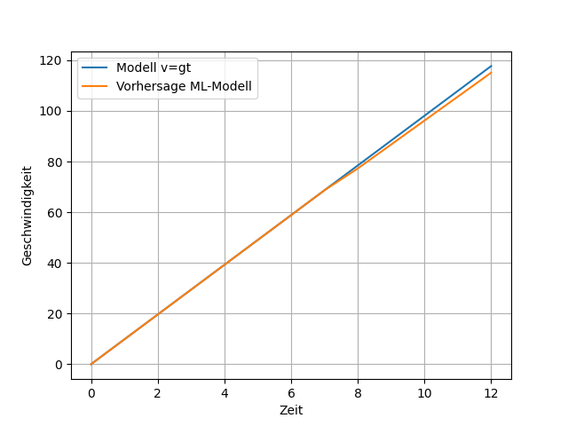

# ML-Model_Freier_Fall

Python-Skript zur Erstellung eines einfachen Neuronalen Netzes mit einem Neuron zur Vorhersage des Geschwindigkeitsverlaufs des einfachen Freien Falls. 

Das Skript berechnet die Geschwindikeit des freien Falls (ohne Luftwiderstand) für 12 Sekunden über die Gleichung $v = gt$.

Als Trainigsdaten für das Neuronal Netz werden die ersten 7 Sekunden des GEschwindigkeitsverlauf genutzt. 
Vorhergesagt wird anschließend der Geschwindigkeitsverlauf von Sekunde 8 - 12. 

Vergleich von pyhsikalischen Modell und neuronalen Netz:

